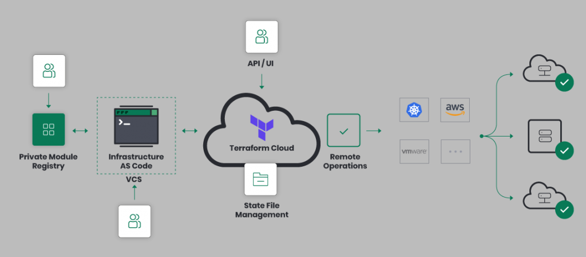

# Terraform Cloud
## Sign up for Terraform Cloud
Terraform Cloud is an application that manages Terraform runs in a consistent and reliable environment instead of on your local machine. This solution simplifies environment management, code execution, state file management, as well as permissions management.

1. Create an account

    Visit https://app.terraform.io/signup/account and follow the prompts to create a free Terraform Cloud account.
    
2. Once your account is ready. In the Terraform Cloud UI will ask which setup workflow you'd like use. Select "Start from scratch."

3. Create an organization
    
    In this step we are prompted to create a new organization. You can add members to your organization and they will be able to collaborate on your workspaces.
    > **_NOTE:_** If you want to join an existing organization to collaborate with others, give the organization's administrator the email address you used to create this account, they will be able to send you an invite.
    

## Create Workspace
Once your Terraform Cloud account is ready and your created or joined a new organization, you can start managing version-controlled infrastructure.

1. Choose your workflow
    Choose the workflow to use, we choose Version Control Workflow (it will store our configuration in the repository and will trigger runs on pull requests and merges similar to jenkins pipelines)
    

2. Connect to VCS
    We choose the version control that will hold our configuration for this workspace.
    
    > **_NOTE:_** After that we login to the VCS to authorize this request from Terraform Cloud.
    
3. Choose a repository

4. Configure settings

5. Finally, click on **"Create workspace"**

## Configure Notifications
We configure the notifications whenever a build is started, we set up slack for notifications:
1.

## Configure Permissions for Terraform Cloud
1. Create an IAM object so terraform can create/delete AWS services
    * Open [IAM Administration Console](https://console.aws.amazon.com/iam/home)
    * Create a new User
    
    * Add User information
    
    * Create a new group for this user
    
    * Assign the new group to the new user
    
    * Add some tags
    * The credentials for this new user are created
    
2. Configure the **ACCESS_KEY_ID** and **SECRETE_ACCESS_KEY** in terraform cloud.
    * Go to Variables and add new **Environment Variables**, mark them as sensitive not to be shown in the UI.
    