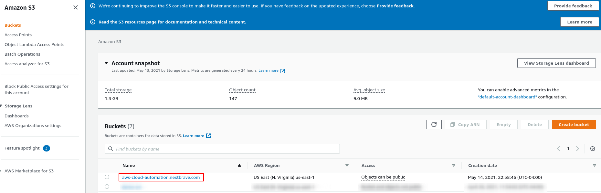

# Terraform Cloud
## Sign up for Terraform Cloud
Terraform Cloud is an application that manages Terraform runs in a consistent and reliable environment instead of on your local machine. This solution simplifies environment management, code execution, state file management, as well as permissions management.


1. Create an account

    Visit https://app.terraform.io/signup/account and follow the prompts to create a free Terraform Cloud account.
    
2. Once your account is ready. In the Terraform Cloud UI will ask which setup workflow you'd like use. Select "Start from scratch."

3. Create an organization
    
    In this step we are prompted to create a new organization. You can add members to your organization and they will be able to collaborate on your workspaces.
    > **_NOTE:_** If you want to join an existing organization to collaborate with others, give the organization's administrator the email address you used to create this account, they will be able to send you an invite.
    

## Create Workspace
Once your Terraform Cloud account is ready and your created or joined a new organization, you can start managing version-controlled infrastructure.

Requisites: 

* Have already a github account and a repository to be used for the example later in this guide.
    

1. Choose your workflow
    Choose the workflow to use, we choose Version Control Workflow (it will store our configuration in the repository and will trigger runs on pull requests and merges similar to jenkins pipelines)
    

2. Connect to VCS
    We choose the version control that will hold our configuration for this workspace.
    
    > **_NOTE:_** After that we login to the VCS to authorize this request from Terraform Cloud.
    
3. Choose a repository

4. Configure settings

5. Finally, click on **"Create workspace"**

## Configure Notifications
We configure the notifications whenever a build is started, we set up slack for notifications:
1.

## Configure Permissions for Terraform Cloud
1. Create an IAM object so terraform can create/delete AWS services
    * Open [IAM Administration Console](https://console.aws.amazon.com/iam/home)
    * Create a new User
    
    * Add User information
    
    * Create a new group for this user
    
    * Assign the new group to the new user
    
    * Add some tags
    * The credentials for this new user are created
    
2. Configure the **ACCESS_KEY_ID** and **SECRETE_ACCESS_KEY** in terraform cloud.
    * Go to Variables and add new **Environment Variables**, mark them as sensitive not to be shown in the UI.
    

# Create an AWS S3 bucket
## Clone the repository
1. Lets clone the repository we connected with Terraform Cloud.
    ```
    git clone <repository_url>
    e.g.
    git clone https://github.com/nextbrave/aws-cloud-automation.git 
    ```
2. Let's initialize the terraform project running the below command
    ```
    terraform init
    ```
3. For this example we will create an s3 bucket, for that we need two files **_aws_provider.tf_** and **_aws_s3.tf_** with the following content:
    ```
    #aws_provider.tf
    provider "aws" {
        region  = "us-east-1"
    }

    #aws_s3.tf
    resource "aws_s3_bucket" "aws-cloud-automation-s3" {
        bucket = "aws-cloud-automation.nextbrave.com"
        acl = "private"

        tags = {
            Owner = "terraform-aws-cloud-automation"
            Project = "aws-cloud-automation"
        }
    }
    ```
    
    
4. Let's now commit the changes to the remote repository so we see the runs in terraform cloud.
    ```
    git add --all
    git commit -m "Creating AWS S3 bucket" 
    git push
    ```
5. Let's go the Terraform Cloud UI
    
    
6. For now let's just confirm and apply it and check AWS console if the S3 bucket was created.
    
    
7. Before we continue since in our last example we hd to confirm and apply manually, let's configure Terraform Cloud to do it automatically.
We go to Settings --> General, look for Apply Method and change it to Auto Apply and finally save Seetings:
    
    

## Let's now create one object inside the s3 bucket we created in the step before
1. Create a new terraform file **_aws_s3_bucket_object.tf_** which will create a text file in the bucket and will make it public, we use the previous bucket we created.
    ```
    resource "aws_s3_bucket_object" "aws-cloud-automation-bucket-object" {
        bucket = aws_s3_bucket.aws-cloud-automation-s3.bucket
        key = "helloWorld.txt"
        source = "helloWorld.txt"

        acl = "public-read"

        tags = {
            Owner = "terraform-aws-cloud-automation"
            Project = "aws-cloud-automation"
        }
    }
    ```
    Also let's create a text file with some string inside "**_helloWorld.txt_**"
2. Next we push the changes to the repository to trigger a new run:
    ```
    git add --all
    git commit -m "Adding a text file to the S3 bucket already created" 
    git push
    ```
3. Check Terraform Cloud and AWS console for the object created:
    
    

## Create an AWS EC2 instance and allow this server to be accessed via SSH
1. Create a new terraform file **_aws_ec2.tf_** with the following content:
    ```
        resource = "aws_security_group" "aws-cloud-automation-sg" {
            name = "aws-cloud-automation-sg"
            description = "Allow ssh traffic"

            vpc_id = "vpc-c77b93a1"

            ingress {
                from_port = 22
                protocol = "tcp" 
                to_port = 22
                cidr_blocks = ["0.0.0.0/0"]
            }

            egress {
                from_port = 0
                protocol = "-1" 
                to_port = 0
                cidr_blocks = ["0.0.0.0/0"]
            }
        }

        resource = "aws-instance" "aws-cloud-automation-ec2" {
            ami = "ami-054a31f1b3bf90920"
            instance_type = "t2.micro"

            key_name = "ec2_duocode"

            vpc_security_group_ids = [aws_security_group.aws-cloud-automation-sg.id]


            tags = {
                Name = "aws-cloud-automation-ec2"
                Owner = "terraform-aws-cloud-automation"
                Project = "aws-cloud-automation"
            }
        }
    ```
    > **_NOTE:_**This example creates an ec2 instance and also creates a security group to allow traffic into this instance via SSH protocol.

2. Next we push the changes to the repository to trigger a new run:
    ```
    git add --all
    git commit -m "Creating EC2 instance and allowing traffic on port 22" 
    git push
    ```
3. Check Terraform Cloud and AWS console for the object created:
    
    